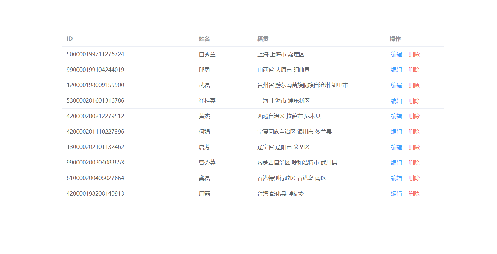

# 1、项目描述：列表增删查

框架：vue3+element-plus
技术：mock 模拟后端数据、axios 请求数据
基本步驟：
① 创建项目并做项目配置（git 管理, prettier+eslint 代码格式规范配置, @别名路径联想）
② 按需导入 element-plus
③ 实现列表查询、删除、编辑功能
效果图：


# 2、创建项目

npm init vue@latest

选择需要安装的依赖:

```
- Peoject name: xxx
- Vue Router: yes
- ESLint: yes
```

安装所有依赖：npm install  
启动项目：npm run dev

# 3、接口说明

## 获取列表

```javascript
axios.get('/list')
```

## 删除

```javascript
axios.delete(`/del/${id}`)
```

## 编辑

```javascript
axios.patch(`/edit/${id}`, {
  name: '姓名',
  place: '籍贯'
})
```
